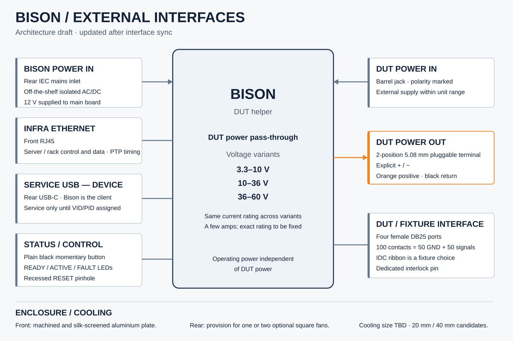
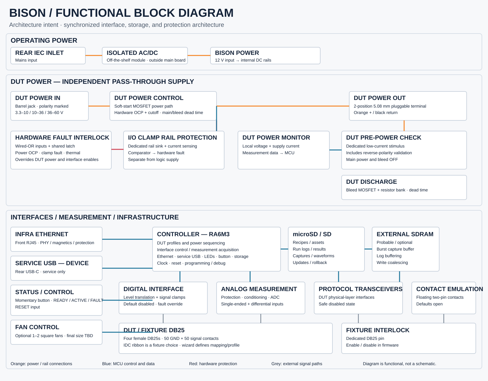
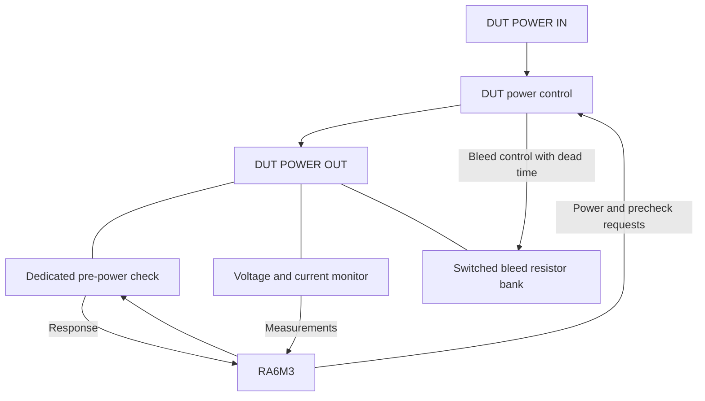
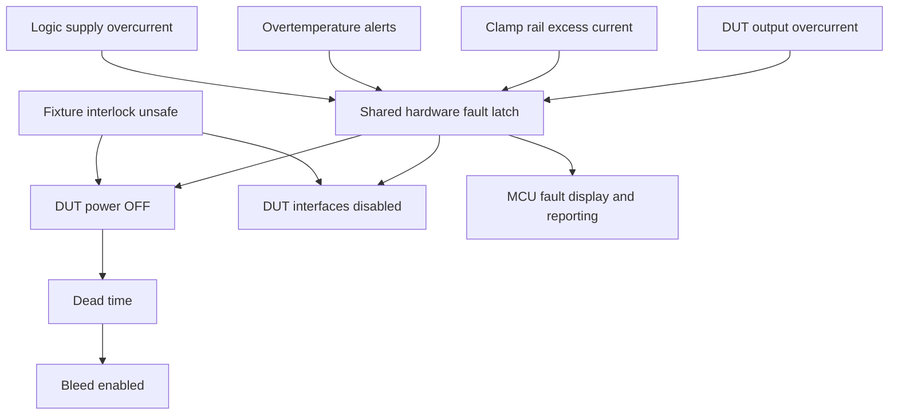

# Bison architecture preparation record

Date: **3 October 2026**

Status: **Preparation phase — architecture decisions recorded; implementation has not started.**

This record consolidates the external interfaces and functional blocks agreed during the Bison architecture walkthrough. It records intent, assumptions and verification work for the implementation handoff. RA6M3 peripheral/pin allocation, final channel counts, component selection, schematic design and circuit validation belong to implementation and are not authorized by this documentation step.

Bison is a reusable networked DUT helper for fixture-based testing and automation. It applies stimuli, controls DUT power, measures responses and runs DUT-specific test profiles. Analog readings are useful test measurements; laboratory-grade accuracy is not claimed.

## Existing contracts

Carry forward the established [DUT interface set](dut-interfaces.md), [front-panel behavior](front-panel-ui.md), [fixture interlock](fixture-interlock.md), [digital protection](digital-interface-protection.md), [mechanical architecture](mechanical-architecture.md), and [north-star appearance](north-star-visual.md). This preparation record does not reopen settled protocol choices or button/color behavior.

For matters changed today, this record and the updated [power architecture](power-architecture.md) and [external interface contract](external-interface.md) take precedence over older descriptions. In particular, the former barrel-jack housekeeping-power assumption is superseded.

## External interface decisions

| Interface | Agreed contract |
|---|---|
| Bison operating power | Rear IEC mains inlet feeding an off-the-shelf isolated AC/DC module. Main-board operating-power input is 12 V; mains conversion is outside the main board. |
| DUT POWER IN | Barrel jack, clearly labeled and polarity marked. External DUT supply is passed through rather than generated or regulated by Bison V1. |
| DUT POWER OUT | 2-position 5.08 mm pluggable screw-terminal system with orange/black visual treatment and explicit + / − markings. |
| Infra Ethernet | Supported host/network interface for control, data, rack integration and PTP-based synchronization. |
| Service USB device | Rear USB-C; Bison is the client/device. Service only pending customer-facing VID/PID allocation. Preserve the existing service USB contract. |
| DUT / fixture DB25 | Six female DB25 fixture ports, arranged mechanically as three stacked pairs, carrying fixed-function channels and the dedicated fixture interlock. The 150 physical contacts are budgeted as 75 GND + 75 functional signal contacts using the recurring GND-SIG-SIG-GND conductor discipline. IDC ribbon is a downstream fixture option, not the Bison connector contract. |
| Front-panel control | Plain black momentary anti-vandal pushbutton plus labelled READY / ACTIVE / FAULT LEDs and RESET pinhole. Preserve the accessible animation and arrow vocabulary. |
| Cooling provisions | Cooling is empirical. Provide room for one or two square fans if testing requires them; 40 mm and 20 mm classes are current candidates. |


### Mechanical baseline

The earlier low-profile desktop extrusion / optional rack-tray concept is superseded. Bison V1 is now a **native 19-inch 1U rack instrument**. The planning target is a short-depth commodity rack chassis, roughly 250-300 mm deep, with bench use supported by optional feet rather than a separate enclosure architecture.

The six DB25 fixture ports are intended as three stacked female/female pairs across the front panel. Exact connector MPN and panel spacing remain implementation items.

### DB25 contact budget

Bison V1 uses six 25-contact fixture connectors, for **150 physical DB25 contacts** total.

The connector fabric reserves these as:

- **75 GND contacts**;
- **75 functional DUT/fixture signal contacts**.

The recurring wiring discipline is `GND-SIG-SIG-GND`. Because each individual DB25 has an odd 25 contacts, the exact pattern phase may alternate between connectors; the six-port aggregate remains 75/75. For IDC-style mating, the pattern is defined in ribbon-conductor order rather than naive D-sub numeric pin order.

The 75 external signal contacts are not assumed to consume exactly 75 RA6M3 pins. Interface electronics may change the MCU-resource ratio; this is resolved in the peripheral/pin budget.

### DUT voltage variants

One universal power implementation is not required. Use these product/power-board voltage ranges:

| Variant range | Current |
|---|---|
| 3.3–10 V | Same current rating across variants |
| 10–36 V | Same current rating across variants |
| 36–60 V | Same current rating across variants |

The intended current is a few amps; the exact rated value remains open. Protection must be checked against the maximum supported voltage of the relevant variant, with component margin. The family ceiling is 60 V, superseding the earlier 48 V family envelope. Bison's operating supply remains independent of DUT power.

## Functional blocks

These are functional boundaries, not final schematic sheet or physical board assignments. Preserve the existing common control-board / replaceable power-board architecture.

| Block | Responsibility and connections |
|---|---|
| Isolated AC/DC module | Off-the-shelf mains-to-12 V module outside the main board. |
| Bison power | 12 V input to internal controller, interface, analog and protection rails. Fans use 12 V directly. |
| DUT power control | Soft-start main MOSFET path, output overcurrent protection and direct hardware cutoff. Receives software power request and hardware fault override. Generates complementary main/bleed control with dead time. |
| DUT discharge | Switched resistor bank across DUT output and return. Receives BLEED_ENABLE from power control. |
| DUT pre-power check | Dedicated low-current stimulus and response measurement across the output and return while main power and bleed are off. |
| DUT power monitor | Local output voltage and supply-current measurements to MCU. Does not replace hardware OCP. |
| I/O clamp rail protection | Dedicated hardware-defined clamp-rail sink, current sensing and comparator. Excess clamp current asserts the hardware fault path. Separate from the 3.3 V logic supply. |
| DUT logic supply and OCP | Supplies DUT-facing translation domains from Bison's internal rails; detects supply overcurrent/contention. Preserve fixed 3.3 V / 5 V interface contracts and the shared-rail architecture. |
| DUT digital interface | Appropriate level translation, clamps, safe disable and hardware fault override. No DUT signal directly reaches an RA6M3 pin. |
| DUT analog measurement | Protected conditioning and acquisition supporting a mix of single-ended and differential measurements. Final analog topology and allocation are deferred. |
| DUT protocol transceivers | Existing protocol-specific physical layers, notably isolated CAN with controllable termination. Do not add RS-232/RS-485 as baseline requirements. |
| DUT contact emulation | Floating two-terminal normally-open contacts, default open with hardware override. Existing PhotoMOS/relay selection remains deferred. |
| Controller RA6M3 | DUT profiles, sequencing, interface control, acquisition, infra Ethernet, service USB, front panel, fan control, storage orchestration and reporting. Includes clock/reset/debug. |
| Internal removable storage | Internal SD or microSD card for active recipe/assets, run logs/results, requested captures, deferred host/CI synchronization, staged runtime/update bundles and rollback data. Retention is time-based; unsynchronized/current data remains pinned. |
| External SDRAM (probable) | Non-safety-critical burst/capture/log buffering and write coalescing between real-time acquisition and Ethernet/SD storage. Final requirement and capacity are deferred to bandwidth/resource analysis. |
| Infra Ethernet | PHY, magnetics and connector protection connected to the MCU Ethernet interface. |
| Service USB device | USB-C configuration, protection, data path and VBUS sensing to the MCU USB peripheral. |
| Front-panel controls/status | Plain momentary anti-vandal input, RESET pinhole, and READY / ACTIVE / FAULT LED outputs using the established accessible animation vocabulary. |
| Fan control | Optional fan support sized after experiment. Architecture should allow one or two square fans; exact 40 mm / 20 mm selection, PWM and tach requirements remain open. |
| Temperature monitor | I2C readings/configuration and open-drain overtemperature alerts wired onto the hardware fault line. |
| Hardware fault interlock | Wired-OR fault inputs and shared latched shutdown. Overrides DUT power and driver enables; MCU receives fault status. |
| DUT / fixture DB25 ports | Six ports collect fixed-function DUT interfaces and the dedicated fixture interlock; main DUT power remains on separate connectors. Connector budget is 75 GND contacts + 75 functional signal contacts. |

The existing fixture interlock remains mandatory. Its safe-state function must be shown in the eventual schematic and resource allocation even though it was not explicitly drawn in the walkthrough overview.

## Architecture overview drawings





The synchronized figures reflect the current interface, storage, protection and UI architecture. They are functional documentation, not product mockups or schematics.

The dedicated fixture interlock remains part of the architecture even when omitted from a simplified overview.

## Power and measurement architecture



Lines to output-parallel blocks represent functional connections to output and return. Current measurement also requires the main-path sensing connection; this is not an electrical wiring diagram.

### Pre-power check and DUT wizard

The new-DUT wizard records the response of a known-good, correctly connected DUT to a small current-limited stimulus. Store the stimulus definition, measured response, settling time and acceptance limits in the DUT profile.

This creates the first profile test: **power-rail sanity check**. Repeat the check before full-power enable. A mismatch keeps power off and reports a failed check.

The pre-power check now also includes explicit reverse-polarity validation for the DUT power connection. The exact circuit/algorithm remains an implementation item, but full-power enable must be blocked when the check identifies swapped DUT power wiring.

This preventive check does not replace the protection requirement: Bison must still survive reversed DUT wiring if the check is bypassed, defeated, or inconclusive. DUT survival is not guaranteed.

The startup model agreed today is:

1. DUT-facing drivers disabled; contacts open; fixture interlock permits operation.
2. Main power and bleed off for the pre-power measurement.
3. Pre-power sanity check, including reverse-polarity validation, passes.
4. Main path ramps up with soft-start.
5. Verify configured voltage checks within the allowed time.
6. Enable DUT interfaces and proceed with remaining tests.

Bank rails must be settled and verified as required before their drivers are enabled. This refines older illustrative sequences that enabled translators before DUT power; detailed sequencing still requires implementation validation.

### Optional voltage sensing at the DUT

Local monitoring checks voltage at Bison's output. Optional DUT-side sensing uses DB25-exposed analog channels in differential configuration, assigned in the new-DUT wizard. It does not require a new dedicated external sense connector.

The analog block must support both single-ended and differential measurement. Input ranges, allowable common-mode voltage, scaling and protection must be defined during implementation; a differential channel must not be assumed safe for direct 60 V sensing merely because it can measure a voltage difference. Preserve the existing 0–5 V input contract pending an explicit design update.

## Reversed DUT power and clamp protection

The fault case discussed today is an initially unpowered DUT with Bison's output leads reversed. DUT survival is not guaranteed; Bison survival is the design priority.

If only the two power leads are swapped:

- DUT power-input positive connects to Bison return.
- DUT ground connects to Bison's positive DUT output.
- The DUT sees negative voltage across its own input.
- Its signals may rise positive relative to Bison through DUT circuitry.

For 12 V, 48 V or the 60 V family ceiling, this is therefore a possible positive signal fault of the corresponding magnitude. If another DB25 ground/reference contact still bonds DUT ground to Bison return, the reversed positive power lead creates a short through that conductor. The power OCP and actual return path must cover that case.

This reversal does not justify extending the negative I/O clamp requirement from roughly −1 V to −5 V. The earlier undershoot protection remains a separate requirement.

Signal clamp diodes steer positive fault current into a dedicated clamp rail. The rail is monitored and protected in hardware rather than placing a large resistor or active protection switch into every signal path. Small signal-integrity/protection resistors and diode loading remain subject to the established interface design.

Active sink/protection circuitry belongs in the rail circuit. BMS designs that handle regenerative current are a useful topology reference, not a selected component solution.

### Hardware trip path



Fixture interlock safe-state behavior is preserved; whether its release also enters the shared latched-fault state is an implementation detail, not a new decision here.

The MCU is outside the protection detection/shutdown path. Software displays/reports the event; any deliberate re-arm must respect the hardware latch and safe-state contract.

### Provisional timing and verification

Allow about **10 µs for current detection plus 10 µs for MOSFET turn-off**, giving a provisional **20 µs source-disconnection budget**. These are targets, not verified maximum response times or a frozen component choice.

During block design, verify:

- comparator/sensing, latch, driver and FET timing, including margins;
- clamp voltage, peak current, aggregate simultaneously faulted channels and diode pulse ratings;
- active sink stability and MOSFET safe operating area;
- power-stage short-circuit response;
- output and DUT stored energy after source cutoff;
- startup, loss of Bison power and externally driven pin behavior;
- no unsafe back-power path or floating clamp rail.

A few-milliamp trip threshold does not constrain peak fault current. A fast cutoff is insufficient if stored energy continues the fault. Soft-start may catch an error earlier, but that depends on DUT internals and must not replace full-voltage protection verification.


## Local storage and buffering architecture

Bison includes internal removable flash storage, with SD or microSD as the current preferred implementation.

This is appliance storage, not a customer-supplied removable-media workflow. It exists so Bison can continue and remain auditable when the host or network is unavailable.

The card stores at least:

- currently loaded recipe and required assets;
- run event logs;
- final structured run results;
- requested captures/waveforms;
- pending host/CI synchronization;
- staged runtime/update bundles;
- current runtime bundle;
- previous known-good rollback bundle where practical.

Retention is time-based rather than a small fixed run count.

Pinned classes include:

- active recipe/runtime;
- current run;
- completed but unsynchronized runs;
- staged candidate update until promoted/discarded;
- rollback runtime according to update policy.

A network outage must not invalidate a test that Bison can safely complete locally. Bison may finish the run, preserve original identifiers/timestamps, and synchronize later.

### Buffering hierarchy

The current expected hierarchy is:

```text
RA6M3 internal SRAM
    |
    v
probable external SDRAM
    |
    +--> Ethernet / host streaming
    |
    v
internal SD/microSD
```

Internal SRAM owns control/runtime state, DMA descriptors and low-latency queues.

External SDRAM is probable rather than frozen. Its purpose is burst/sample buffering, waveform/protocol capture buffering, and log/event coalescing so SD or network latency does not disturb deterministic control. Safety-critical state must not depend solely on external SDRAM.

### Controlled shutdown

Bison should provide enough hold-up energy to detect loss of its own operating power and preserve storage integrity.

On Bison power loss:

1. immediate DUT safety remains owned by the hardware fault/interlock path;
2. firmware stops accepting new work;
3. the active run record is closed or checkpointed;
4. critical buffered data and filesystem metadata are flushed to SD;
5. interrupted work is marked appropriately;
6. Bison shuts down before the hold-up rail collapses.

Hold-up time, capacitor/supercapacitor sizing, powered rails and filesystem strategy remain implementation decisions.


## Discharge and thermal intent

Use a switched bleed resistor bank. Main-switch and bleed-switch controls are complementary with dead time: main OFF first, then bleed ON; bleed OFF before main ON. Hardware faults use the same cutoff/discharge interlock.

Initial capacitance assumption: **470 µF**. At 60 V, stored energy is approximately **0.85 J**. A 100 ms discharge corresponds to approximately 8.5 W average over that interval; an exponential resistor discharge has a higher initial power. A 100 W, 10 ms rectangular pulse is 1 J, but equal energy is not proof of equal resistor pulse capability.

Reserve space for a few **2012 imperial SMD resistors**, approximately 5.1 × 3.0 mm each. The discussion supports feasibility, not a selected count, resistance, rating or guaranteed discharge time. Select these against actual pulse curves, repetitive duty, DUT capacitance and required off-voltage. Verify the rail falls below the DUT profile's off threshold before restart.

Cooling will be finalized experimentally. Reserve practical rear-panel/chassis provisions for one or two square fans if testing shows they are required; 40 mm and 20 mm classes are current candidates. I2C temperature monitors assert open-drain hardware thermal faults. Sensor locations, thresholds and fan duty policies remain implementation work.

## Preparation boundary and implementation handoff

This record closes the documentation step for the agreed architectural walkthrough. It does not declare the design electrically validated, certified or ready for manufacture, and does not launch implementation.

Keep open for the implementation phase:

- exact current rating and voltage-boundary tolerances;
- RA6M3 package, peripheral/DMA/timer/ADC budget, pin allocation and channel counts;
- stacked DB25 connector MPN and final numbered pin allocation within the frozen six-port / 75-signal budget;
- power-board/control-board connector and physical partition details;
- actual power FETs, soft-start controller, shunts, detectors, thresholds and clamp sinks;
- bleed resistance/count and allowed repeated cycling;
- analog single-ended/differential implementation and voltage/common-mode envelope;
- thermal sensor placement/thresholds, fan parts and thermal checks;
- SD/microSD interface implementation, filesystem and retention details;
- external SDRAM requirement/capacity from worst-case capture bandwidth;
- power-fail detection and hold-up-energy sizing for controlled shutdown;
- grounding, PE/chassis and signal-return bonding;
- fixture and power-up/down sequencing verification;
- compliance planning and fault-validation evidence.

The preparation process defines the work, dependencies and review checkpoints before implementation. No peripheral allocation, circuit implementation or channel-count freeze is performed in this documentation change.

