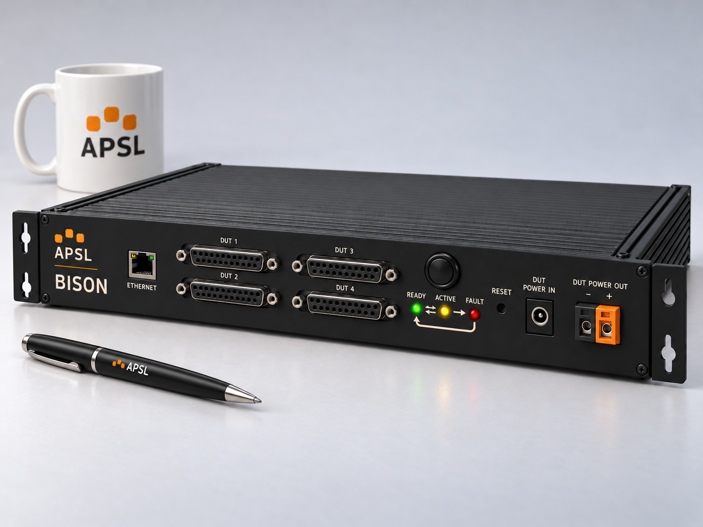

# Bison Visual North Star

The approved front render below defines the current visual north star for Bison. The earlier front render remains a historical reference.

They are styling and product-language references, not dimensionally accurate CAD or fabrication drawings.

## Approved front reference

- Repository asset: `docs/assets/bison-front-accessible-status.png`
- Approved 3 October 2026.
- Plain black momentary anti-vandal button; no illuminated RGB ring.
- Three labelled status LEDs below the button, left to right: READY, ACTIVE, FAULT.
- Opposing half-arrows between READY and ACTIVE; ACTIVE → FAULT; return path FAULT → READY.
- Mug and pen provide an approximate visual scale reference.

The image is a styling concept, not a valid simultaneous LED state or a specification of dimensions, brightness, or electrical ratings.

## Earlier reference images

- `bison-north-star-front.png`
- `bison-north-star-rear.png`

The source images are preserved in the APSL/Bison/North Star asset library.

## Visual direction

Freeze the following product-language decisions:

- low-profile rack/bench instrument form;
- dark APSL charcoal enclosure;
- warm cream/off-white panel legends;
- orange APSL branding/accent;
- plain black momentary anti-vandal switch body;
- black Ethernet presentation where practical;
- four DUT/fixture D-sub ports presented as two stacked pairs;
- recessed RESET control;
- dedicated DUT power input and controlled DUT power output;
- restrained front panel with labelled READY, ACTIVE and FAULT LEDs below the button and orange/black DUT-power terminals;
- accessibility through indicator position, labels and directional animation rather than colour alone;
- shared APSL branding, typography, controls and status vocabulary across the product family;
- removable rack ears / rack-mount presentation while remaining usable as a benchtop instrument.

## Front reference

The front render is the primary aesthetic reference for:

- enclosure color and finish;
- logo treatment;
- typography hierarchy;
- connector visual density;
- spacing feel;
- black hardware treatment;
- orange/black DUT-power-output treatment;
- overall proportion and product character.

The exact D-sub geometry, cutouts, spacing, and enclosure dimensions must come from the selected production parts and mechanical design.

## Shared status vocabulary

The dedicated LEDs replace the earlier RGB-ring proposal. READY and FAULT use position to distinguish otherwise similar animations.

| State | Indication |
| --- | --- |
| Booting | LEDs cycle in sequence |
| Pre-operational | READY: green sinusoidal breathing |
| Idle / Ready | READY: steady green |
| Starting | Brightness sweeps from READY to ACTIVE |
| Running | ACTIVE: steady red |
| Stopping | Brightness sweeps from ACTIVE to READY |
| Error | FAULT: red blinking, with product-specific error pattern |
| Resetting error | FAULT: red sinusoidal breathing; successful reset returns to READY |

Starting uses initial perceived-brightness targets READY/ACTIVE of 100/0, 65/35, 35/65, 0/100, then 0/0 percent. Stopping reverses the sweep. PWM levels and timing remain to be tuned on the physical indicators. ACTIVE must support amber for transitions and red for running.

Silkscreen expresses READY ↔ ACTIVE, ACTIVE → FAULT and FAULT → READY. This is a simplified operator-facing indication, not an exhaustive firmware transition graph. Product-specific error codes still require documentation.

## Rear reference

The rear render establishes the same enclosure language from the back and provides a scale reference using an ordinary mug and pen.

The rear connector content in the concept render is illustrative only. The electrical and mechanical architecture documents remain authoritative for the actual rear-panel interfaces.

## Rule

> Use these renders to answer “should Bison look and feel like this?” — not “where exactly should this hole be drilled?”

Any future mechanical refinement should preserve this visual language unless there is a concrete manufacturing, usability, compliance, or thermal reason to depart from it.
